# Kubernetes Homelab

A production-grade, bare-metal Kubernetes homelab cluster built on Debian 13. Deployed with shell scripts and Helm, managed declaratively through GitOps via Argo CD, and equipped with a full observability, security, autoscaling, and network segmentation stack.

---

## Table of Contents

- [Architecture](#architecture)
- [Stack Overview](#stack-overview)
- [Security](#security)
- [Networking & DNS](#networking--dns)
- [Directory Structure](#directory-structure)
- [Prerequisites](#prerequisites)
- [Deployment Guide](#deployment-guide)
- [Service Access](#service-access)
- [GitOps with Argo CD](#gitops-with-argo-cd)
- [Retrieving Credentials](#retrieving-credentials)
- [Configuration Reference](#configuration-reference)

---

## Architecture

### Cluster Topology

| Role | Hostname | IP | Notes |
|---|---|---|---|
| Control Plane | `debian` | `<CONTROL_PLANE_IP>` | kubeadm init, kubectl, Helm, CoreDNS LAN DNS |
| Worker Node 1 | `debianos` | `<WORKER1_IP>` | Wired ethernet, static IP |
| Worker Node 2 | `node2` (ThinkCentre) | `<WORKER2_IP>` | Wired ethernet, static IP |

- **OS:** Debian 13 (Trixie) — bare-metal
- **Kubernetes:** v1.36.0 (node2: v1.36.1)
- **Container runtime:** containerd.io (Docker repo, systemd cgroup driver)
- **CNI:** Cilium v1.19.3 in kube-proxy replacement mode (eBPF datapath)
- **Ingress:** Cilium Gateway API — HTTP + HTTPS (TLS terminated at Gateway)
- **Load balancer:** MetalLB (L2 mode, LAN IP pool `<METALLB_POOL_START>–<METALLB_POOL_END>`)
- **Storage:** Longhorn v1.11.1 (distributed block storage, 2 replicas per volume)
- **Pod CIDR:** `10.244.0.0/16`
- **All nodes:** wired ethernet only (WiFi disabled — causes firmware crashes on Intel cards)

### Network Flow

```
Client (LAN)
    │
    ▼ DNS: *.<YOUR_DOMAIN> → <GATEWAY_IP>
CoreDNS LAN Pod (<CONTROL_PLANE_IP>:53)
    │
    ▼
MetalLB LoadBalancer IP (<GATEWAY_IP>)
    │
    ▼
Cilium Gateway (homelab-gateway) — TLS terminated here
    │  wildcard cert: *.<YOUR_DOMAIN> (cert-manager, auto-renews)
    │
    ├── HTTPRoute → Argo CD        (https://argocd.<YOUR_DOMAIN>)
    ├── HTTPRoute → Grafana        (https://grafana.<YOUR_DOMAIN>)
    ├── HTTPRoute → Prometheus     (https://prometheus.<YOUR_DOMAIN>)
    ├── HTTPRoute → Alertmanager   (https://alertmanager.<YOUR_DOMAIN>)
    ├── HTTPRoute → Longhorn UI    (https://longhorn.<YOUR_DOMAIN>)
    ├── HTTPRoute → Falcosidekick  (https://falco.<YOUR_DOMAIN>)
    ├── HTTPRoute → Headlamp       (https://headlamp.<YOUR_DOMAIN>)
    └── HTTPRoute → Hubble UI      (https://hubble.<YOUR_DOMAIN>)

Argo CD CLI (gRPC):
    <ARGOCD_LB_IP> (direct LoadBalancer) → argocd-grpc.<YOUR_DOMAIN>
```

---

## Stack Overview

### Networking

| Component | Namespace | Version | Purpose |
|---|---|---|---|
| Cilium | `kube-system` | 1.19.3 | CNI, kube-proxy replacement, Gateway API controller, Hubble observability |
| MetalLB | `metallb-system` | latest | Assigns LAN IPs to `LoadBalancer` services (L2 mode) |
| Gateway API CRDs | `kube-system` | v1.2.1 | Standard Gateway API resources consumed by Cilium |
| CoreDNS LAN | `lan-dns` | v1.14.2 | Local DNS resolver — `*.<YOUR_DOMAIN>` wildcard, no `/etc/hosts` needed |

### Storage

| Component | Namespace | Version | Purpose |
|---|---|---|---|
| Longhorn | `longhorn-system` | 1.11.1 | Distributed block storage — Prometheus (20Gi), Grafana (2Gi), Loki (10Gi) |

### TLS & Certificates

| Component | Namespace | Purpose |
|---|---|---|
| cert-manager | `cert-manager` | Self-signed CA + wildcard `*.<YOUR_DOMAIN>` cert — auto-renews, trusted on all nodes |

### GitOps

| Component | Namespace | Purpose |
|---|---|---|
| Argo CD | `argocd` | Declarative GitOps continuous delivery (App-of-Apps pattern) |

### Monitoring & Observability

| Component | Namespace | Purpose |
|---|---|---|
| kube-prometheus-stack | `monitoring` | Prometheus + Alertmanager + Grafana — full metrics pipeline, 30-day retention |
| Loki | `monitoring` | Log aggregation (SingleBinary, 10Gi Longhorn PVC) |
| Grafana Alloy | `monitoring` | Unified observability agent — pod logs + Kubernetes events → Loki |
| Falcosidekick | `falco` | Routes Falco security events → Loki (all) + Slack `#homelab-security` (error+) |
| metrics-server | `kube-system` | Lightweight resource metrics for `kubectl top` |
| Prometheus Adapter | `monitoring` | Resource metrics API (custom metrics removed — use KEDA when needed) |

### Security

| Component | Namespace | Purpose |
|---|---|---|
| Kyverno | `kyverno` | Policy engine — 7 policies (6 Enforce, 1 Audit) |
| Falco | `falco` | Runtime security — eBPF syscall monitoring (`modern_ebpf`, no kernel headers) |
| Falcosidekick | `falco` | Falco event router → Loki + Slack |
| Trivy Operator | `trivy-system` | Continuous CVE scanning, config audits, RBAC assessment |
| Cosign | — | Image signing — key pair generated, public key in cluster |

### Visualisation

| Component | Namespace | Purpose |
|---|---|---|
| Headlamp | `headlamp` | CNCF Sandbox — full Kubernetes UI with topology, RBAC, plugins |
| Hubble UI | `kube-system` | Cilium network flow visualisation (bundled with Cilium) |

---

## Security

### TLS Everywhere

All services are served over HTTPS. TLS is terminated at the Cilium Gateway using a wildcard certificate (`*.<YOUR_DOMAIN>`) issued by cert-manager's self-signed CA.

```bash
# Verify TLS
curl -v https://grafana.<YOUR_DOMAIN> 2>&1 | grep -E "subject|issuer|verify"
# subject: CN=*.<YOUR_DOMAIN>
# issuer: O=Homelab; CN=homelab-ca
# SSL certificate verify ok.
```

The CA certificate is distributed to all nodes and can be imported into browsers for trusted HTTPS.

### Kyverno Admission Policies

7 ClusterPolicies enforce the **Pod Security Standards Restricted** profile on all workload namespaces:

| Policy | Mode | Enforcement |
|---|---|---|
| `disallow-latest-tag` | **Enforce** | Images must use pinned tags |
| `disallow-root-containers` | **Enforce** | `runAsNonRoot: true` required |
| `require-resource-limits` | **Enforce** | CPU + memory limits required |
| `disallow-privilege-escalation` | **Enforce** | `allowPrivilegeEscalation: false` required |
| `disallow-privileged-containers` | **Enforce** | No `privileged: true` |
| `require-drop-all-capabilities` | **Enforce** | `capabilities.drop: [ALL]` required |
| `verify-image-signatures` | **Audit** | Images from `ghcr.io/JonesKwameOsei/*` must be Cosign-signed |

System namespaces (kube-system, monitoring, argocd, etc.) are excluded from enforcement.

**Testing enforcement:**
```bash
# This is rejected by 4 policies simultaneously
kubectl run test --image=nginx:latest -n test-app --dry-run=server
# Error: disallow-latest-tag, disallow-privilege-escalation,
#        disallow-root-containers, require-resource-limits
```

**Compliant pod template:**
```yaml
spec:
  securityContext:
    runAsNonRoot: true
    runAsUser: 1000
  containers:
  - name: app
    image: nginx:1.27-alpine    # pinned tag
    resources:
      requests: {cpu: 50m, memory: 64Mi}
      limits: {cpu: 200m, memory: 128Mi}
    securityContext:
      allowPrivilegeEscalation: false
      readOnlyRootFilesystem: true
      capabilities:
        drop: [ALL]
```

### Runtime Security — Falco

Falco runs as a DaemonSet on all 3 nodes using the `modern_ebpf` driver (no kernel headers needed on Debian 13 / kernel 6.x). It detects:

- Shell spawned inside a container
- Sensitive file reads (`/etc/shadow`, `/etc/sudoers`)
- Log clearing activity
- Privilege escalation attempts
- Unexpected network connections

All events are routed via **Falcosidekick** to:
- **Loki** — full audit trail, queryable in Grafana: `{app="falcosidekick"}`
- **Slack `#homelab-security`** — `error` and `critical` priority events only

```logql
# Query Falco events in Grafana → Explore → Loki
{app="falcosidekick", priority=~"error|critical"}

# Events by rule
{app="falcosidekick"} | json | rule="Terminal shell in container"
```

### Network Segmentation — CiliumNetworkPolicy

Zero-trust network segmentation applied to `test-app`, `monitoring`, `argocd`, and `falco` namespaces:

- **Default deny** all ingress (implicit in Cilium's policy model)
- **Allow** Gateway traffic via `fromEntities: ingress` (Cilium's `reserved:ingress` identity)
- **Allow** same-namespace pod communication
- **Allow** Prometheus scraping from `monitoring` namespace

```bash
# Verify cross-namespace traffic is blocked
kubectl exec -n test-app deploy/nginx -- \
  wget -qO- --timeout=3 http://loki.monitoring.svc:3100/ready
# wget: download timed out ✅ (blocked)
```

### Image Signing — Cosign

Cosign key pair generated. Public key stored in cluster as `cosign-pub-key` secret in `kyverno` namespace. The `verify-image-signatures` policy is in Audit mode — switch to Enforce after setting up CI signing.

**CI signing workflow (GitHub Actions):**
```yaml
- name: Sign the image
  env:
    COSIGN_KEY: ${{ secrets.COSIGN_PRIVATE_KEY }}
    COSIGN_PASSWORD: ${{ secrets.COSIGN_PASSWORD }}
  run: |
    cosign sign --key env://COSIGN_KEY \
      ghcr.io/joneskwameosei/my-app@${{ steps.build.outputs.digest }}
```

### Vulnerability Scanning — Trivy Operator

Trivy Operator continuously scans all workloads for CVEs, misconfigurations, and RBAC issues:

```bash
# Check vulnerability reports
kubectl get vulnerabilityreports -A --sort-by='.report.summary.criticalCount' | head -10

# Check config audit reports
kubectl get configauditreports -A
```

### etcd Backup

Daily etcd snapshots at 02:00, stored at `/var/backups/etcd/` on the control plane:

```bash
# Manual backup trigger
kubectl create job etcd-backup-manual --from=cronjob/etcd-backup -n kube-system

# View backup files
sudo ls -lh /var/backups/etcd/
# -rw------- 1 root root 41M May 7 14:45 etcd-snapshot-2026-05-07_134522.db.gz
```

---

## Networking & DNS

### DNS Architecture

The cluster runs a **CoreDNS pod** (`lan-dns` namespace) as the LAN DNS resolver, eliminating all `/etc/hosts` maintenance:

```
All nodes (/etc/resolv.conf → nameserver <CONTROL_PLANE_IP>)
      │
      ▼
CoreDNS LAN pod (hostNetwork, port 53, on control plane)
      │
      ├── *.<YOUR_DOMAIN> → <GATEWAY_IP> (wildcard template)
      ├── argocd-grpc.<YOUR_DOMAIN> → <ARGOCD_LB_IP> (hosts plugin)
      └── everything else → forward to <ROUTER_IP> + 8.8.8.8
```

**Key implementation details:**
- `hostNetwork: true` — pod uses the host's network namespace
- systemd-resolved stub listener disabled (`DNSStubListener=no`) to free port 53
- `/etc/resolv.conf` locked with `chattr +i` to prevent NetworkManager overwriting
- Wildcard template: any new `*.<YOUR_DOMAIN>` service resolves automatically — no DNS config changes needed

**Adding a new service:**
1. Create an HTTPRoute with `hostnames: ["my-new-app.<YOUR_DOMAIN>"]`
2. DNS resolves automatically — no DNS config changes needed

**Updating DNS for a non-Gateway IP:**
```bash
kubectl edit configmap coredns-lan -n lan-dns
# Add to the hosts block:
# <NEW_SERVICE_IP> my-special-service.<YOUR_DOMAIN>
kubectl rollout restart deployment coredns-lan -n lan-dns
```

### Cilium Gateway API

All services use the Kubernetes Gateway API (not the deprecated Ingress resource):

```yaml
apiVersion: gateway.networking.k8s.io/v1
kind: HTTPRoute
metadata:
  name: my-app
  namespace: my-namespace
spec:
  parentRefs:
  - name: homelab-gateway
    namespace: kube-system
    sectionName: https
  hostnames:
  - "my-app.<YOUR_DOMAIN>"
  rules:
  - matches:
    - path:
        type: PathPrefix
        value: /
    backendRefs:
    - name: my-app-service
      port: 8080
```

### Hubble Network Observability

Hubble provides live network flow inspection without a service mesh:

```bash
# Watch live traffic
cilium hubble port-forward &
hubble observe --follow

# Show dropped flows (policy violations)
hubble observe --verdict DROPPED --follow

# DNS queries
hubble observe --protocol dns --follow
```

---

## Directory Structure

```
kubernetes-homelab/
├── control-plane/
│   ├── 01-prepare-os.sh              # OS hardening, kernel params, containerd — run on ALL nodes
│   ├── 02-install-kubernetes.sh      # kubeadm, kubelet, kubectl install (v1.36)
│   ├── control-plane.sh              # kubeadm init (kube-proxy skipped for Cilium)
│   ├── 04-install-cilium.sh          # Cilium CNI + Gateway API + Hubble
│   ├── 05-verify.sh                  # Cluster health check
│   ├── 06-gateway-setup.sh           # GatewayClass + Gateway resource
│   ├── 07-argocd-gitops.sh           # Argo CD App-of-Apps bootstrap
│   ├── addons.sh                     # All Helm addons
│   ├── lan-dns.yaml                  # CoreDNS LAN DNS resolver
│   ├── network-policies.yaml         # CiliumNetworkPolicy for all namespaces
│   ├── kyverno-additional-policies.yaml  # Extra Kyverno policies
│   ├── kyverno-image-verification.yaml   # Cosign image signing policy
│   ├── prometheus-grafana-storage.yaml   # Persistent storage for monitoring
│   ├── alertmanager-config-direct.yaml   # Alertmanager Slack config
│   ├── etcd-backup-cronjob.yaml      # Daily etcd backup
│   ├── falco-with-sidekick.yaml      # Falco + Falcosidekick values
│   ├── headlamp-values.yaml          # Headlamp Kyverno-compliant values
│   └── homelab-gitops/               # GitOps repository (watched by Argo CD)
│       ├── apps/                     # Argo CD Application manifests
│       └── manifests/                # Application manifests synced by Argo CD
└── worker-node/
    ├── 01-prepare-os.sh              # Same OS prep as control-plane version
    ├── 02-install-kubernetes.sh      # Same k8s package install
    └── worker-nodes.sh               # kubeadm join
```

---

## Prerequisites

### All Nodes

- Debian 13 (Trixie) — bare-metal or VM
- Minimum: 2 vCPU, 4 GB RAM, 40 GB disk per node
- Static LAN IP addresses assigned to each node
- SSH access as a user with `sudo` privileges

### Control Plane Only

- A free IP range on your LAN **outside** the router's DHCP range (for MetalLB)
- A Git repository to serve as the GitOps source for Argo CD

### Longhorn Prerequisite (all nodes — before running `addons.sh`)

```bash
sudo apt-get install -y open-iscsi nfs-common
```

---

## Deployment Guide

### Step 1 — Prepare OS (all nodes)

```bash
sudo bash 01-prepare-os.sh [--node-name <hostname>]
sudo bash 02-install-kubernetes.sh
```

Handles: swap disable, kernel modules, sysctl tuning, time sync (chrony), containerd.io installation.

### Step 2 — Initialise the Control Plane

```bash
sudo bash control-plane.sh
```

Runs `kubeadm init` with kube-proxy skipped. **Save the `kubeadm join` command** for workers.

### Step 3 — Install Cilium CNI

```bash
sudo bash 04-install-cilium.sh
```

Installs Cilium with `kubeProxyReplacement=true`, `gatewayAPI.enabled=true`, `hubble.relay.enabled=true`.

### Step 4 — Install All Addons

Set `METALLB_IP_RANGE` in `addons.sh`, then:

```bash
sudo bash addons.sh
```

### Step 5 — Join Worker Nodes

Fill in `CONTROL_PLANE_IP`, `JOIN_TOKEN`, `CA_CERT_HASH` in `worker-nodes.sh`, then run on each worker:

```bash
sudo bash worker-nodes.sh
```

### Step 6 — Configure Gateway + GitOps

```bash
bash 06-gateway-setup.sh
bash 07-argocd-gitops.sh
```

### Step 7 — Apply Security & DNS

```bash
# TLS certificates
kubectl apply -f cert-manager-issuers.yaml   # see session3.md

# Network policies
kubectl apply -f control-plane/network-policies.yaml

# Kyverno additional policies
kubectl apply -f control-plane/kyverno-additional-policies.yaml

# DNS resolver
kubectl apply -f control-plane/lan-dns.yaml

# Configure all nodes to use the DNS pod
sudo bash -c 'echo "nameserver <CONTROL_PLANE_IP>" > /etc/resolv.conf'
sudo chattr +i /etc/resolv.conf
```

---

## Service Access

All services resolve via the CoreDNS LAN pod. No `/etc/hosts` entries needed.

| Service | URL | Purpose |
|---|---|---|
| Argo CD | `https://gitops.<YOUR_DOMAIN>` | GitOps UI |
| Argo CD CLI | `gitops-grpc.<YOUR_DOMAIN>` | gRPC CLI access |
| Grafana | `https://grafana.<YOUR_DOMAIN>` | Metrics + logs dashboards |
| Prometheus | `https://prometheus.<YOUR_DOMAIN>` | Metrics query UI |
| Alertmanager | `https://alertmanager.<YOUR_DOMAIN>` | Alert routing UI |
| Longhorn | `https://longhorn-ebpf.<YOUR_DOMAIN>` | Storage management UI |
| Falcosidekick UI | `https://falco-sec.<YOUR_DOMAIN>` | Security event dashboard |
| Headlamp | `https://headlamp-cui.<YOUR_DOMAIN>` | Kubernetes cluster UI |
| Hubble UI | `https://mycilium.<YOUR_DOMAIN>` | Network flow visualisation |

### Argo CD

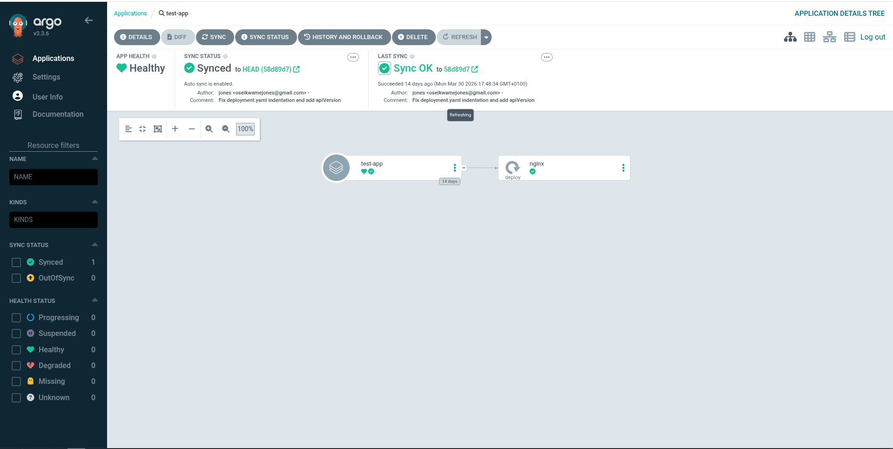
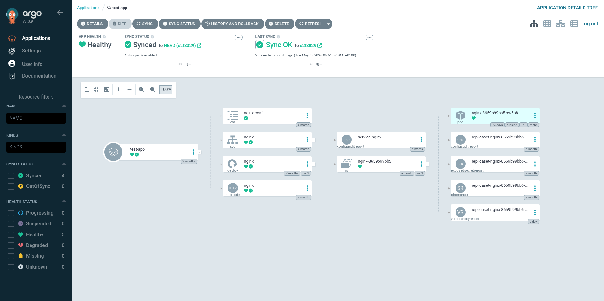

---

### Grafana

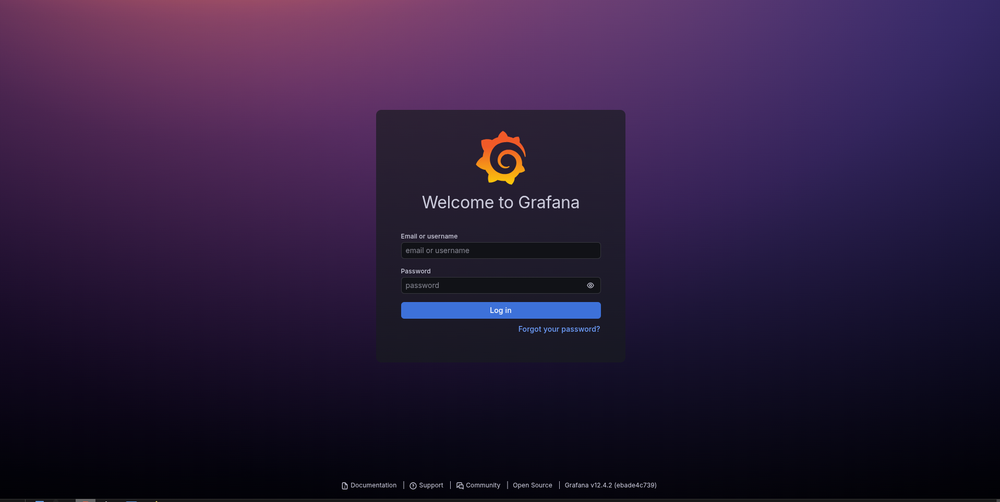
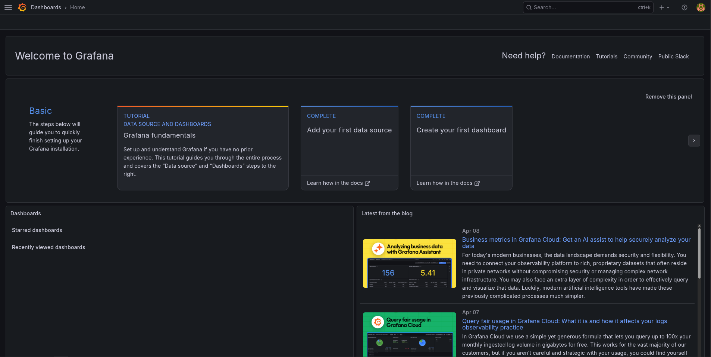

---

### Prometheus

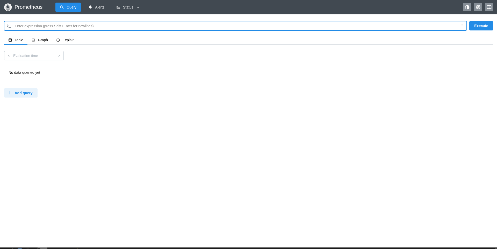

---

### Alertmanager

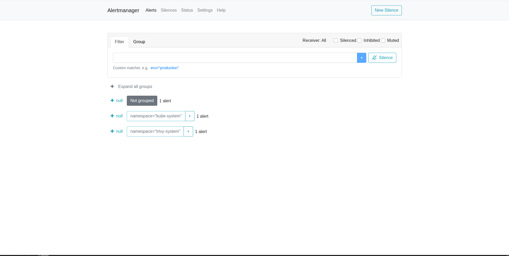

---

### Longhorn

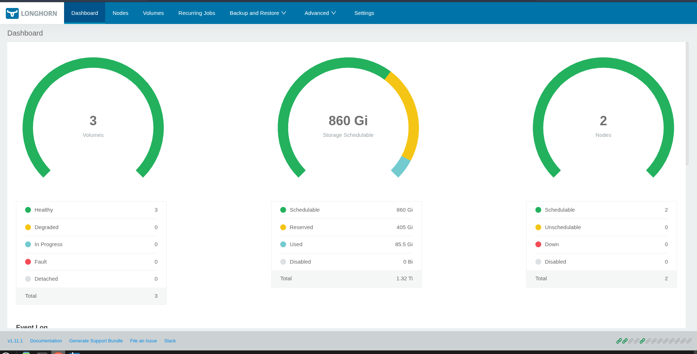

---

### Headlamp (Cluster UI)

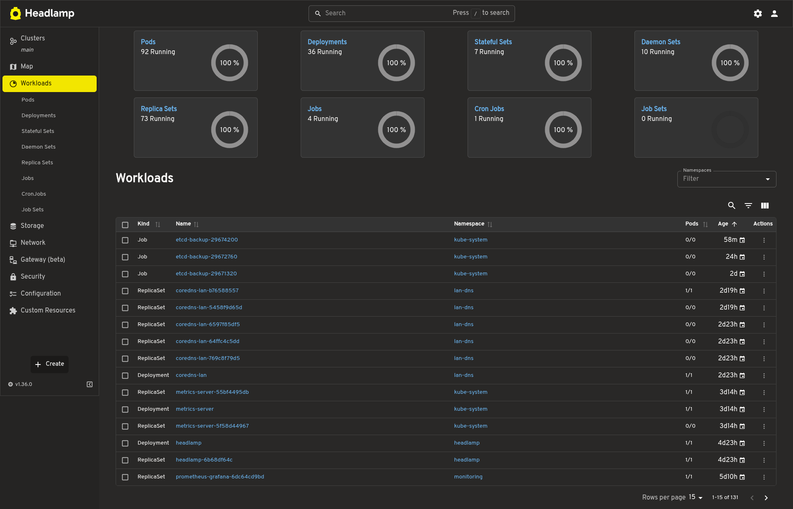
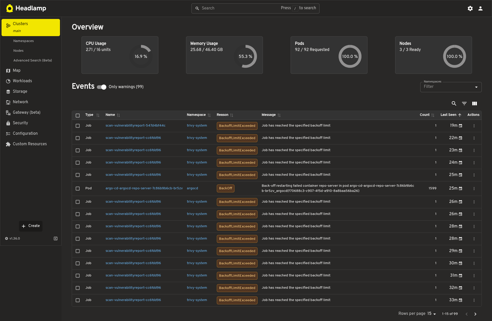
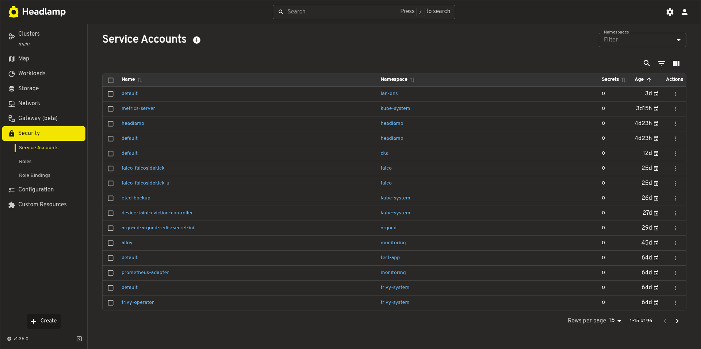
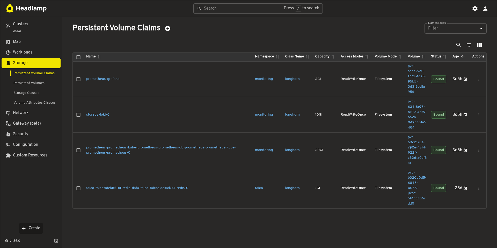

---

### Hubble (Network Observability)

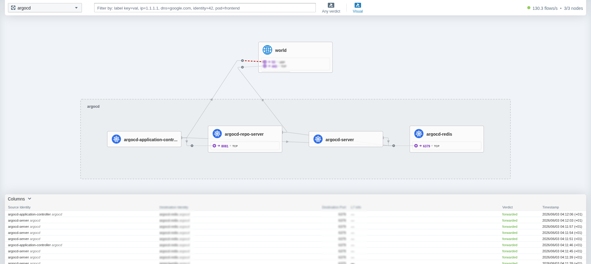

---

### Loki — Log Aggregation

Logs from all pods and Kubernetes events are collected by **Grafana Alloy** and shipped to Loki. Query logs in Grafana via **Explore → Loki datasource**.

**Datasource configuration:**
- URL: `http://loki-gateway.monitoring.svc.cluster.local`
- HTTP Header: `X-Scope-OrgID: homelab` (required — multi-tenancy enabled)

**Useful LogQL queries:**

```logql
# All logs across the cluster
{job=~".+/.+"}

# Filter by namespace
{namespace="argocd"}

# Errors only
{job=~".+/.+"} |= "error"

# Kubernetes cluster events
{job="integrations/kubernetes/eventhandler"}

# Falco security events
{app="falcosidekick", priority=~"error|critical"}

# Falco events by rule
{app="falcosidekick", rule="Terminal shell in container"}
```

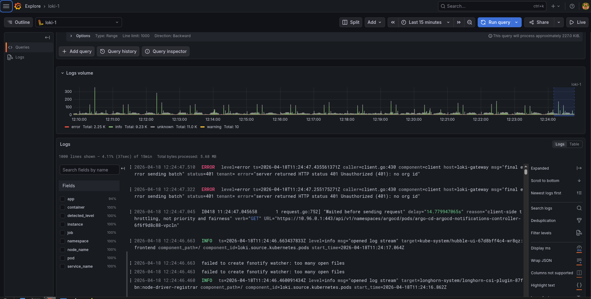
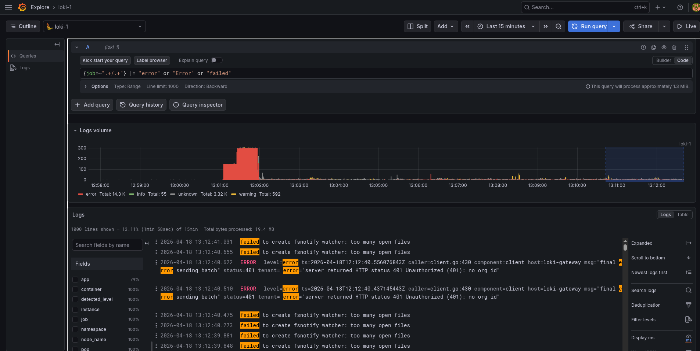

---

## GitOps with Argo CD

The cluster follows the **App-of-Apps** pattern:

```
homelab-gitops/
├── apps/
│   ├── app-one.yaml        # Argo CD Application manifest
│   └── app-two.yaml
└── manifests/
    ├── app-one/
    │   └── deployment.yaml
    └── app-two/
        └── deployment.yaml
```

**Example Application manifest:**

```yaml
apiVersion: argoproj.io/v1alpha1
kind: Application
metadata:
  name: my-app
  namespace: argocd
spec:
  project: default
  source:
    repoURL: https://github.com/JonesKwameOsei/homelab-gitops
    targetRevision: HEAD
    path: manifests/my-app
  destination:
    server: https://kubernetes.default.svc
    namespace: my-app
  syncPolicy:
    automated:
      prune: true
      selfHeal: true
    syncOptions:
    - CreateNamespace=true
```

**Example HTTPRoute (HTTPS via Gateway):**

```yaml
apiVersion: gateway.networking.k8s.io/v1
kind: HTTPRoute
metadata:
  name: my-app
  namespace: my-app
spec:
  parentRefs:
  - name: homelab-gateway
    namespace: kube-system
    sectionName: https
  hostnames:
  - "my-app.<YOUR_DOMAIN>"
  rules:
  - matches:
    - path:
        type: PathPrefix
        value: /
    backendRefs:
    - name: my-app-service
      port: 8080
```

---

## Retrieving Credentials

**Argo CD admin password** (if initial secret still exists):
```bash
kubectl get secret argocd-initial-admin-secret -n argocd \
  -o jsonpath='{.data.password}' | base64 -d && echo
```

**Reset Argo CD password:**
```bash
NEW_HASH=$(kubectl exec -n argocd deploy/argo-cd-argocd-server -- \
  argocd account bcrypt --password '<new-password>')
kubectl patch secret argocd-secret -n argocd \
  --type merge \
  -p "{\"stringData\":{\"admin.password\":\"${NEW_HASH}\",\"admin.passwordMtime\":\"$(date +%FT%T%Z)\"}}"
kubectl rollout restart deployment argo-cd-argocd-server -n argocd
```

**Grafana admin password** (reset via CLI):
```bash
kubectl exec -n monitoring deploy/prometheus-grafana \
  -c grafana -- grafana cli admin reset-admin-password '<password>'
```

**Headlamp login token:**
```bash
kubectl create token headlamp --namespace headlamp --duration=8760h
```

---

## Configuration Reference

| Variable | Script | Description |
|---|---|---|
| `METALLB_IP_RANGE` | `addons.sh` | Free LAN IP range for MetalLB LoadBalancer services |
| `ARGOCD_REPO_URL` | `07-argocd-gitops.sh` | Git repository URL for Argo CD to watch |
| `CONTROL_PLANE_IP` | `worker-nodes.sh` | IP address of the control plane node |
| `JOIN_TOKEN` | `worker-nodes.sh` | kubeadm bootstrap token |
| `CA_CERT_HASH` | `worker-nodes.sh` | kubeadm CA certificate hash (`sha256:...`) |
| `K8S_VERSION` | `control-plane.sh` | Kubernetes version to initialise with |
| `K8S_MINOR` | `02-install-kubernetes.sh` | Kubernetes minor version for apt repo (e.g. `v1.36`) |
| `CILIUM_VERSION` | `04-install-cilium.sh` | Cilium release to install |
| `GATEWAY_API_VERSION` | `04-install-cilium.sh` | Gateway API CRD version |

### Key Design Decisions

- **Cilium replaces kube-proxy** — `kubeadm init` is run with `--skip-phases=addon/kube-proxy`. Do not add a kube-proxy DaemonSet.
- **Cilium Gateway uses `reserved:ingress` entity** — NetworkPolicies must use `fromEntities: ingress` (not `namespaceSelector: kube-system`) to allow Gateway traffic.
- **Falco uses `modern_ebpf` driver** — works on Debian 13 / Linux kernel 6.x without kernel headers.
- **Loki runs in `SingleBinary` mode** with filesystem storage on a Longhorn PVC — appropriate for homelab.
- **Prometheus Adapter serves resource metrics only** — custom metrics removed. Use KEDA for event-driven autoscaling when needed.
- **Loki multi-tenancy is enabled** — all Loki API calls require `X-Scope-OrgID: homelab`.
- **Single Gateway for all services** — one MetalLB IP, all traffic routed via HTTPRoutes on `homelab-gateway`.
- **Grafana Alloy replaces Promtail** — Promtail is deprecated. Alloy handles pod logs and Kubernetes events. Config uses a values file (not `--set`) to avoid Helm parser issues with River syntax.
- **CoreDNS LAN pod replaces /etc/hosts** — wildcard `*.<YOUR_DOMAIN>` template means new services resolve automatically. systemd-resolved stub listener must be disabled on the control plane.
- **Kyverno enforces Pod Security Standards Restricted** — all new workloads must comply. Use a values file with security context settings when installing Helm charts.
<!-- - **KEDA removed** — no event-driven workloads currently. Reinstall when needed: `helm install keda kedacore/keda --namespace keda --create-namespace --wait`. -->
